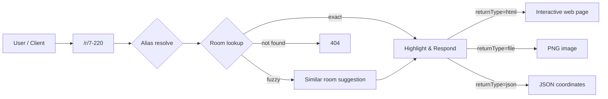

# MeetMap — Indoor Room Finder & Directory Service

## Overview

MeetMap is a Python Flask web application for **indoor navigation**. It extracts room numbers and coordinates from building floor plan images via OCR, then serves an interactive web UI and RESTful API so users can look up any room and instantly see its location on the floor map.

Key use‑cases:

- **Finding meeting rooms** — search by room number, alias, or tag and get a highlighted map.
- **Directory browsing** — a `/` menu page lists every building → floor → room with popularity ranking (Top 10).
- **Custom location sharing** — mark any coordinate on a floor map and share a URL with a note.
- **Programmatic integration** — JSON API returns room coordinates for other applications.

## Features

- **Automated Room Extraction** — OCR (EasyOCR, lazy‑loaded) detects room numbers from floor plan images.
- **Interactive Map View** — highlights rooms on the floor map with building/floor labels, compass, and gate indicators.
- **Directory & Search** — browse buildings, floors, and rooms; client‑side search with tag and synonym support.
- **Tag System** — rooms annotated with keywords (e.g., 회의실, 영상, 교육장) displayed as badges and searchable.
- **Access Popularity** — timestamp‑based rolling‑window (100 days) counter; Top 10 shown on the menu page.
- **Alias Management** — human‑friendly names (e.g., `행정동` → `1-`, `도서관 화상 회의실` → `7-136`).
- **Fuzzy Matching** — approximate room‑number matching with optional strict mode.
- **Multiple Return Types** — HTML (interactive), PNG image, or JSON (for programmatic use).
- **Custom Location Sharing** — `x`, `y`, `note` query parameters to mark and share arbitrary spots.
- **QR Code Generation** — share room URLs via QR codes directly from the map view.
- **Skyview & Room Photos** — optional satellite view links and interior room photos.

## Project Structure

```
meetmap/
├── meetmap.py                 # Main Flask application
├── requirements.txt           # Python dependencies
├── init.sh                    # Auto‑setup script (venv + install + run)
│
├── map.json                   # Auto‑generated room coordinate data (from OCR)
├── map-customization.json     # Manual room overrides (custom locations, named spots)
├── map-alias.json             # Alias mappings (friendly names → room/building IDs)
├── map-note.json              # Building metadata (name, compass, gate, skyview link)
├── map-tags.json              # Room tag annotations (keywords for search & display)
├── access-count.json          # Auto‑generated access log (timestamp‑based)
│
├── image/
│   ├── map/                   # Floor plan images (e.g., 7-5.png = building 7, floor 5)
│   ├── room/                  # Optional interior photos (e.g., 7-511.png)
│   └── skyview/               # Optional satellite images (e.g., 7.jpg)
│
├── assets/
│   ├── favicon.ico
│   └── NanumSquareL.ttf       # Korean font for image rendering
│
├── conf/
│   └── nginx.conf             # Reference Nginx reverse‑proxy config (HTTPS)
│
├── tmp/                       # Runtime cache (annotated map images)
├── testset.txt                # Room IDs for validation testing
├── testing.sh                 # Test runner script
├── LICENSE                    # Apache 2.0
└── THIRD_PARTY_LICENSES       # Third‑party license notices
```

## Installation

### Prerequisites

- Python 3.11+

### Quick Start (Linux)

```bash
git clone https://github.com/seokho-son/meetmap.git
cd meetmap
sudo ./init.sh          # creates venv, installs deps, starts server on port 80
```

### Manual Setup

```bash
python3 -m venv .venv
source .venv/bin/activate
pip install -r requirements.txt

# Add floor plan images
mkdir -p image/map image/room image/skyview
# Place floor plan PNGs in image/map/ (naming: <building>-<floor>.png, e.g., 7-5.png)

# Run (port 80 requires root on Linux)
sudo python meetmap.py
```

On first run, the app analyzes all floor plan images via OCR and saves results to `map.json`. Subsequent runs reuse the existing data unless you opt to re‑analyze.

## API Endpoints

### `GET /` — Directory Menu

Interactive page listing all buildings, floors, and rooms. Includes:
- Client‑side search with tag synonym support (e.g., searching "화상" also matches "영상")
- Top 10 popular rooms (collapsed by default)
- Room tags displayed as badges

### `GET /r/<room_id>` — Room Lookup

View a room location on the floor map. Also available via `/room/`, `/view/`, `/find/`, `/dir/`, `/v/`, `/f/`, `/d/`.

| Parameter | Description |
|---|---|
| `returnType=html` | (default) Interactive web view with map, compass, buttons |
| `returnType=file` | Floor map image as PNG |
| `returnType=json` | Room location data as JSON |
| `strict=true` | With `returnType=json`: return 404 if no exact match (disable fuzzy matching) |
| `note` / `n` / `label` / `title` | Display a note label on the map |
| `x`, `y` | Mark a custom point on the map |

**JSON response example** (`/r/7-220?returnType=json`):

```json
{
  "found": true,
  "exact_match": true,
  "request_id": "7-220",
  "room_id": "7-220",
  "building_id": "7",
  "building_name": "대전본원 7동",
  "floor": "7-2",
  "floor_id": "2",
  "image_size": [4000, 3000],
  "location": {
    "x_ratio": 45.2,
    "y_ratio": 32.1,
    "w_ratio": 3.5,
    "h_ratio": 4.2
  }
}
```

### `GET /r` or `GET /room` — Room List

Returns all room IDs and aliases as JSON.

| Parameter | Description |
|---|---|
| `key` or `k` | Filter by keyword |

### `GET /alias` — Alias Data

Reloads and returns alias mappings from `map-alias.json`.

### `GET /api` — API Documentation

Styled HTML page listing all available endpoints with descriptions and parameters.

### `GET /validate` — Validation

Generates combined validation images for testing OCR accuracy.

## Configuration Files

### `map-alias.json` — Aliases

Maps friendly names to room or building IDs. Building aliases end with `-`.

```json
{
    "행정동": "1-",
    "식당동": "5-",
    "도서관 화상 회의실": "7-136",
    "한식당": "5-한식당"
}
```

### `map-customization.json` — Custom Rooms

Adds rooms that OCR cannot detect (named locations, special areas). Merged with `map.json` at load time.

```json
{
    "5-한식당": {
        "floor": "5-1",
        "x_ratio": 44.6,
        "y_ratio": 65,
        "w_ratio": 60,
        "h_ratio": 30
    }
}
```

### `map-note.json` — Building Metadata

Defines building names, compass orientation, main gate position, and skyview links.

```json
{
    "7": {
        "building_name": "대전본원 7동",
        "north_x": 50,
        "north_y": 3,
        "main_gate_x": 5.5,
        "main_gate_y": 51.2,
        "skyview_link": "https://map.kakao.com/..."
    }
}
```

| Field | Description |
|---|---|
| `building_name` | Display name for the building |
| `north_x`, `north_y` | Compass north indicator position (% of image) |
| `main_gate_x`, `main_gate_y` | Main entrance indicator position (% of image) |
| `skyview_link` | External satellite view URL |

### `map-tags.json` — Room Tags

Annotates rooms with searchable keywords displayed as badges in the directory.

```json
{
    "7-220": ["회의실", "10석"],
    "7-386": ["회의실", "영상"],
    "3-118": ["소강당", "100석"]
}
```

Tags are used for:
- Blue badge display on room chips in the menu
- Search matching (including synonym expansion: 화상/온라인 → 영상)

### `map.json` — Room Coordinate Data

Auto‑generated by OCR analysis. Stores detected room positions as ratios relative to the floor plan image. **Do not edit manually** — use `map-customization.json` for overrides.

### `access-count.json` — Access Log

Auto‑generated. Stores per‑room access timestamps for the Top 10 popularity ranking. Uses a 100‑day rolling window with automatic pruning.

## Architecture

### Floor Plan Image Naming

Images in `image/map/` follow the convention `<building_id>-<floor_id>.png`:

| File | Building | Floor |
|---|---|---|
| `7-5.png` | Building 7 | 5th floor |
| `1-2.png` | Building 1 | 2nd floor |
| `701-1.png` | Building 701 (대경권 1동) | 1st floor |

### Request Flow



### Deployment

The application runs as a Flask development server by default (port 80). For production:

- **Gunicorn** is included in `requirements.txt` for WSGI deployment.
- **Nginx** reverse proxy config is provided in `conf/nginx.conf` (HTTPS support).

```bash
# Production example with gunicorn
gunicorn -w 4 -b 0.0.0.0:80 meetmap:app
```

## License

This project is licensed under the **Apache 2.0 License**.

### Third‑Party Licenses

This project depends on various third‑party open‑source libraries distributed under their respective licenses (BSD, MIT, Apache 2.0, etc.).  
See **[THIRD_PARTY_LICENSES](./THIRD_PARTY_LICENSES)** for details.
