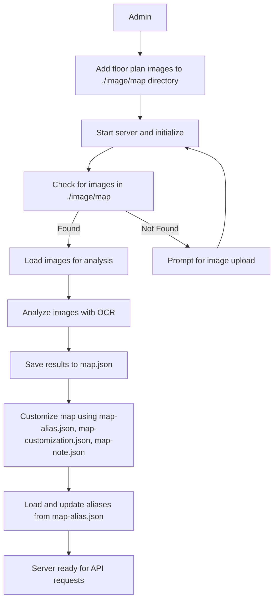
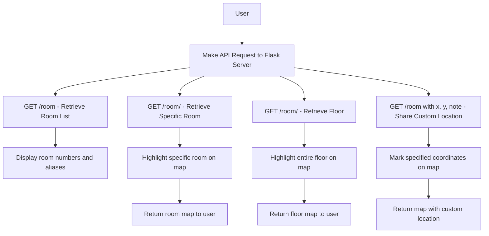

# MeetMap Project

## Overview

MeetMap is a Python-based Flask web application that facilitates indoor navigation by extracting room numbers and their coordinates from building floor plan images. Utilizing advanced image processing techniques and Optical Character Recognition (OCR), MeetMap provides interactive maps and a RESTful API for managing and visualizing room locations.

This application is particularly useful for:
- **Finding meeting rooms** by identifying room numbers and highlighting their positions on floor maps.
- **Sharing custom indoor locations** by specifying coordinates and notes, allowing users to generate shareable links to precise spots within buildings.
- **Customizing building maps** with aliases and notes for more intuitive navigation.

## Features

- **Automated Room Extraction:** Detects and extracts room numbers using OCR.
- **Custom Location Sharing:** Mark and share any custom location within a building using API query parameters.
- **Image Processing:** Enhances text detection through contrast adjustments and filtering.
- **RESTful API:** Provides endpoints to manage and visualize room data.
- **Alias Management:** Supports custom aliases for rooms and buildings.
- **Interactive Visualization:** Highlights room locations and custom points on floor maps interactively.
- **Multiple Data Files:** Supports customization and notes through JSON configurations.
- **Room Similarity Matching:** Suggests similar room numbers for approximate matches.

## Installation

### Clone the Repository

```bash
git clone https://github.com/your-username/meetmap.git
cd meetmap
```

### Prerequisites

Ensure you have Python 3.x installed along with the following packages:

```bash
pip install Flask numpy Pillow opencv-python-headless easyocr torch torchvision
```

Or install them using the provided requirements file:

```bash
pip install -r requirements.txt
```

## Usage

### Setting Up

1. **Prepare Directories:**
   - Create the `./image/map/` directory and add floor plan images (e.g., `7-5.png` for the 5th floor of building 7).
   - (Optional) Create `./image/room/` for specific room images (e.g., `7-511.png` for room 511 in building 7).

```bash
mkdir -p ./image/map ./image/room
```

2. **Run the Application:**

For most systems, port 80 is used to run the API server. **On Linux, you may need to use `sudo`** to run the server on port 80:

```bash
sudo python meetmap.py
```

3. **Optional Script for Ubuntu Users:**
   Automate the setup with the provided script:

```bash
sudo ./init.sh
```

### API Endpoints

1. **`GET /`**   Lists all available API endpoints.

2. **`GET /room`** or **`GET /r`**   Retrieves a list of all extracted room numbers and aliases.

   - **Query Parameters:**
     - `key` or `k`: Filter rooms by keyword.

3. **`GET /room/<room_number>`** or **`GET /view/<room_number>`**   Highlights and returns an image with the specified room number.

   - **Query Parameters:**
     - `returnType=file`: Return the raw image file instead of HTML.
     - `x`, `y`: Specify coordinates to mark a custom location.
     - `note`: Add a custom note to display on the map.

4. **`GET /room/<building-floor>`**   Retrieves and highlights an entire floor within a specified building.

   - **Example:** `/room/7-5` displays the 5th floor of building 7.
   - **Query Parameters:**
     - `x`, `y`: Highlight specific coordinates on the floor.
     - `note`: Add a custom note to display.

5. **`GET /alias`**   Reloads and returns alias data from `map-alias.json`.

6. **`GET /validate`**   Combines multiple images for validation and returns the result.

### Example API Calls

- Retrieve a list of room numbers:

```bash
curl http://localhost/room
```

- View an image with a specific room highlighted:

```bash
curl http://localhost/room/7-511
```

- Share a custom location with coordinates and note:

```bash
curl "http://localhost/room/7-5?x=45.2&y=60.1&note=내위치"
```

## Customization with JSON Files

MeetMap supports multiple JSON files to customize the application:

### 1. **`map-alias.json`**

Defines custom aliases for rooms and buildings.

**Example:**

```json
{
    "행정동": "1-",
    "식당동": "5-",
    "도서관 화상 회의실": "7-136"
}
```

- **Usage:** Call `/alias` to reload and view these aliases.

### 2. **`map-customization.json`**

Adds or overrides room coordinates and properties.

**Example:**

```json
{
    "5-한식당": {
        "floor": "5-1",
        "x_ratio": 44.6,
        "y_ratio": 65,
        "w_ratio": 60,
        "h_ratio": 30
    }
}
```

- **Usage:** Customizations are automatically merged when loading map data.

### 3. **`map-note.json`**

Defines metadata related to building orientation and entrance locations.

**Example:**

```json
{
    "1": {
        "building_name": "행정동",
        "north_x": 50,
        "north_y": 97,
        "main_gate_x": 50,
        "main_gate_y": 93
    },
    "5": {
        "building_name": "식당동(5동)",
        "north_x": 50,
        "north_y": 3,
        "main_gate_x": 92.7,
        "main_gate_y": 50.2
    }
}
```

- **Fields:**
  - `building_name`: Name of the building.
  - `north_x`, `north_y`: Coordinates indicating the north direction.
  - `main_gate_x`, `main_gate_y`: Coordinates of the building's main entrance.

- **Usage:** This file is used to adjust the orientation and labeling on the map for better navigation.

### 4. **`map.json`**

The main file where analyzed room data is stored after processing images.

- **Usage:** Automatically generated or updated after running the application.

## Architecture

### Admin Workflow



### User Workflow



## License

This project is licensed under the Apache 2.0 License.
