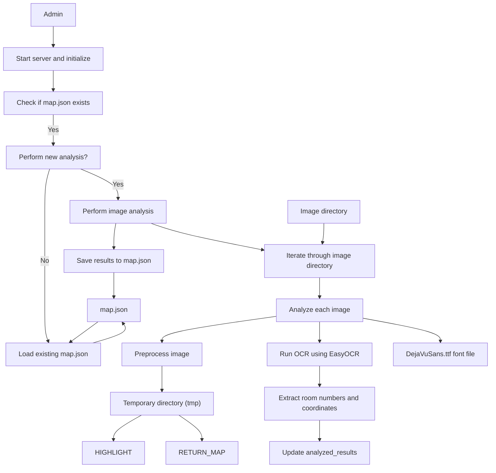
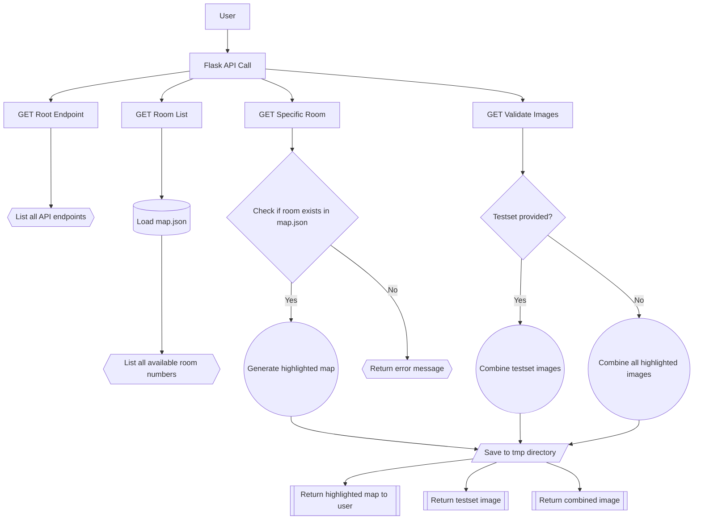

# MeetMap Project

## Overview
MeetMap is a Python-based Flask web application that extracts room numbers and their coordinates from images. It utilizes image processing and Optical Character Recognition (OCR) to identify text within images and store the location information of the detected text. This application is particularly useful for mapping room numbers in building layouts or similar scenarios.

## Features
- Automated extraction of room numbers using OCR.
- Image processing for enhanced text detection.
- Flask web server with RESTful API for data management.
- Room number similarity analysis for approximate matches.
- Interactive image visualization with highlighted room numbers.
- Support for handling multiple floor images and complex room number formats.

## Installation

### Clone the Repository
Clone the repository to your local machine:
```bash
git clone https://github.com/your-username/meetmap.git
cd meetmap
```
Add image files to ./image/ directory.
Example of the file name of an image file is `7-5.png` which means the fifth floor of the building 7.

### Prerequisites
- Python 3.x
- Flask numpy Pillow opencv-python-headless easyocr torch torchvision

Install them using the following command:
```bash
# pip install Flask numpy Pillow pytesseract opencv-python-headless
# pip or pip3
pip install -r requirements.txt
```

## Usage

### Running the Application

Run the application with the following command:

```bash
python meetmap.py
```

Script for Ubuntu users. (will automate installation)
```bash
./init.sh
```

If a map.json file already exists, the program will ask whether to perform a new analysis or use the existing data. The analyzed data is saved in a temporary directory (tmp) and as a JSON file (map.json).

### API Endpoints
1. GET /: Lists all available API endpoints.
1. GET /room: Retrieves a list of all extracted room numbers.
1. GET /room/<room_number>: Highlights and returns an image with the specified room number.
   - force=true: Forces the creation and combination of new images, ignoring any cached combined image.
   - Without force parameter or with force=false: Returns a previously generated combined image if it exists.
1. GET /validate: Combines multiple images into one and returns the combined image. 
   - testset=true: Generates and combines images for room numbers read from testset.txt.
   - force=true: Forces the creation and combination of new images, ignoring any cached combined image.
   - Without force parameter or with force=false: Returns a previously generated combined image if it exists.

### Example API Calls
To retrieve a list of room numbers:
```bash
curl http://localhost:1111/room
```

To view an image with a specific room number highlighted:
```bash
curl http://localhost:1111/room/1-222
```


# Architecture
- Admin interections



- User interections




## License
This project is licensed under the Apache 2.0 License.
